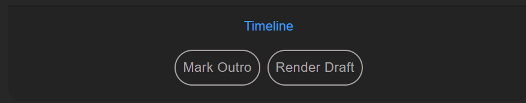

# Moon Active Editor's Toolbox

Here's a quick scan of the options this panel offers:

## The Coin Master logo

##### The logo makes this panel look nice, but it's also functional:
- click the logo to reveal corner selection.
- drag the logo into the timeline to add.

#### * Dragging assets (Logo / Outro / Audio)
occasionally dragging into the timeline doesn't work. I'm not sure exactly why. if dragging into the timeline doesn't work, drag the asset into the project window, and then bring it into the timeline.

## Timeline

#### Mark Outro
`Mark Outro` is an important step in making life easier for our editors. This button will add a marker named `outro` to the timeline, allowing us later to     grammatically locate and replace the outro when localizing the videos, with no need to open Premiere.

#### Render Draft
`Render Draft` will do the following:
- Create a new folder inside `Z:/ART/Projects/<project folder>/07. Render/03. Ongoing Versions` with today's date as a name.
- Render the timeline using a h.264 preset. if in/out markers are present these will be used. otherwise it will go by the work area.
- Create a subfolder named `PPP` and place a copy of the project there.

#### Render Master [hidden]
The `Render Master` button is hidden and will appear when you click the **Timeline** title.  
It will render a master file (uncompressed *quicktime animation*) into `Z:/ART/Projects/<project folder>/07. Render/05. Master`. 
>**rendering a master is not an everyday task. render a master only once all necessary approvals has been given and the video is finalized.**
>*don't forget to `Mark Outro` before rendering a master video.*

## Project

#### Save++
`Save++` is equivalent to After Effect's `save incremental`. It's essentially a quick "Save As" command, locating the current project file and preforming a "Save As" to the same location, adding an incrementing number (`_01`) to the filename. If the next number is already taken it will be skipped.

#### Export AAF
Will do exactly what you think. All output options (including output location) are pre-defined, so no worries.

## Footage

> Here's where we get to the good stuff. The Footage buttons lets you manipulate the selected videos on the timeline.  
> Where normally you would have to look for the *"Effects Controls"* Panel (how come it's never there when you need it??) and start manipulating your videos one at a time - now there's a quick and easy way. All buttons are able to manipulate as many files as you have selected, though if you have a bunch things might start to get laggy.  

> Buttons are draggable as well (though "Reset" isn't)  

#### Scale (-/+)
##### Click:
Clicking these will scale the videos by 5%.
+ Use `Shift` to scale by 10%
+ Use `alt` to scale by 1%

##### Drag:
Drag to continuously scale up and down the footage.
+ Use `Shift` to scale faster.
+ Use `alt` to fine scale nice and slowly.

#### Rotate (⭯/⭮)
+ Click to rotate by 90°.
+ Drag to rotate continuously. `Shift` and `alt` will work here as well.

#### Reset
You might assume the `Reset` is self-explanatory, but that's hardly the case here.  
This is a powerful button. As you might expect - it will scale, rotate and reposition your timeline videos.  
In terms of `position`, it will always align the footage to the center of the frame. The `scale` and `rotate` operations are dependent on a couple of elements:
+ if the `rotation` value is multiple of 90° (-90, 0, 90, 180, 270 etc.) the value will remain as is. any other value will be reset to 0°.
+ by default, the `scale` will be set to **fit** your video in it's entirety inside the frame.
+ holding `shift` while clicking will set the scale to **fill** the frame - meaning some of the video might be cropped.
+ holding `ctrl` while clicking will scale the footage to its original size (100%).

#### Move (bitch, get out the way)
This might be my favorite. it's a neat little joystick, and oh my, it's indeed full of joy. dragging this button around will drag the selected videos on timeline accordingly, letting you reposition multiple videos with ease.  
`shift/alt` modifiers will work here as they do for scale/rotate - massive and fine movement respectively.

## Formats

These buttons let's you easily change the dimensions of the frame (sequence settings). you see three of them (landscape / portrait / square), but `shift` clicking the portrait button will make your frame `2:3`
+ `ctrl` click to duplicate current sequence and change to new dimensions (this will also give a suffix to the new sequence name - for example *"Sequence Name_square"*)

## Outro

Choose the language and the type of the outro, and drag this whole section to the timeline to import. You can also alt-drag it as you would any other file, to replace existing video asset present on the timeline.

## Audio (SFX / Music)

Choose audio file using the drop-down menus and drag directly to timeline.
+ `ctrl` click the title ("Game SFX") to switch audio categories.  
+ available audio categories are `Game SFX` / `Non-Game SFX` / `Music` / `Narration`